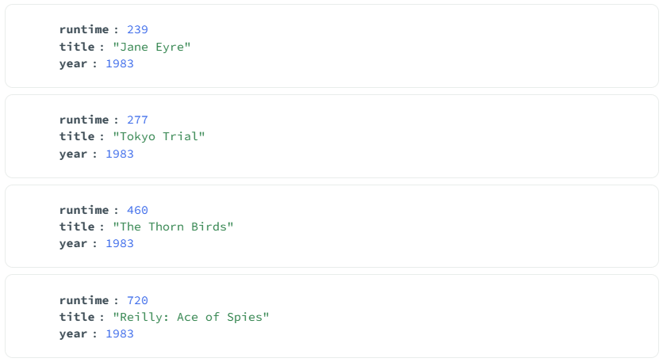
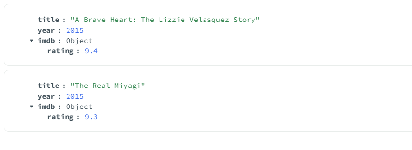

# Assignment 3 - MongoDB Atlas, Community Edition, and Compass

## Overview
This assignment demonstrates:
- signing up for MongoDB Atlas
- creating a free cluster
- connecting to the cluster in MongoDB Compass
- running queries on the sample movie dataset

## Database Used
- Database: `sample_mflix'
- Collection: `movies`

## Query No. 1
Find all movies with runtime greater than 200 minutes in year 1983.  
The results are sorted by runtime in increasing order and only include `runtime`, `title`, and `year`.

### Query
```javascript
db.movies.find(
  { year: 1983, runtime: { $gt: 200 } },
  { _id: 0, runtime: 1, title: 1, year: 1 }
).sort({ runtime: 1 });
```

### Screenshot


## Query No. 2
Find all movies after year 2014 with imdb rating greater than 9.

### Query
```javascript
db.movies.find(
  { year: { $gt: 2014 }, "imdb.rating": { $gt: 9 } },
  { _id: 0, title: 1, year: 1, "imdb.rating": 1 }
).sort({ "imdb.rating": -1 });
```

### Screenshot


## Files in This Repository
- `README.md`
- `queries/queries.js`
- `screenshots/query1_runtime_1983.png`
- `screenshots/query2_rating_after_2014.png`